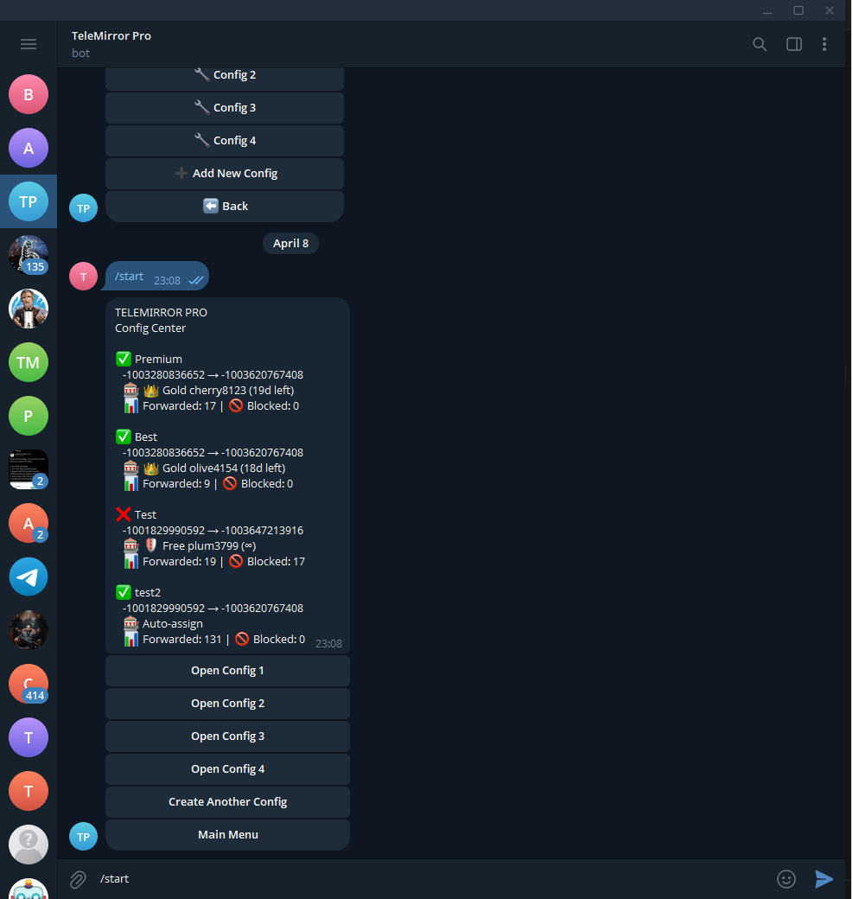

# TeleMirror Pro

A free Telegram automation platform built for fast, simple, and reliable channel forwarding.

TeleMirror Pro helps users automate Telegram forwarding workflows, manage connected sessions, and control everything through an easy web dashboard and Telegram bot.

Telegram automation, Telegram forwarding, Telegram bot, channel forwarding, message forwarder, multi-user Telegram platform, Telegram dashboard, workflow automation

## Why TeleMirror Pro?

- Free to use
- Easy to start
- Fast forwarding setup
- Multi-user support
- Web dashboard included
- Telegram bot access
- Built for reliability and secure operation

## What You Can Do

- Forward messages between Telegram channels
- Manage your forwarding setup from one place
- Connect and manage account sessions
- Use a web dashboard for configuration
- Access the platform directly through the Telegram bot
- Benefit from a stable and protected infrastructure

## Preview

## Try It

- Website: https://www.telemirrorpro.com
- Telegram Bot: https://t.me/TeleMirrorPro_bot

## Built For

TeleMirror Pro is designed for users who want a simple way to automate Telegram workflows without dealing with complicated setup or technical overhead.

## Public Showcase

This repository is a public showcase for TeleMirror Pro and contains preview assets only.
